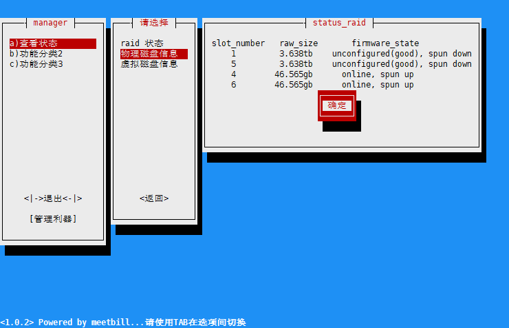

# megacli_tui
megacli 终端界面管理工具

## 使用手册

> * [使用手册](https://github.com/BillWang139967/megacli_tui/wiki)

## 相关项目

> * megacli 库 [megacli-python](https://github.com/m4ce/megacli-python)
> * python TUI 库 [py_menu](https://github.com/BillWang139967/py_menu)

## 版本发布

版本号根据 `three_page.py` 程序而定

* v1.0.3，2017-10-11，新增：修复无创建 raid 组时查询虚拟磁盘失败问题。
* v1.0.2，2017-04-06，新增：虚拟磁盘查询。
* v1.0.1，2017-03-22，新增：发布初始版本。
